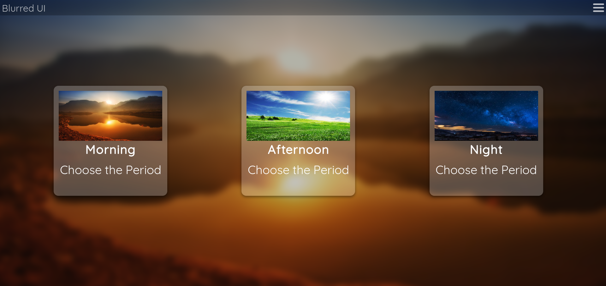

# Blurred-UI
A project to learn how to make blur effect in most html elements without frameworks and with the learning process.

Revisiting this project I did some changes to the code, specially while doing this I studied the `backdrop-filter`. And I used it, even that some years ago I was extremely against using this *HTML* tag, because it wasn't supported on *Firefox*, my browser at the time. But the support for this tag seems to be becoming better in the last years, and I realized that even the technique that I explored and use the most, about using the `::before` pseudo-element, is not supported on *IE* and older versions of some browsers because of the lack of the `filter` tag in *CSS*. So, the only way to fallback and guarantee blur effect cross-browser is through *Javascript* usage, with something like the *StackBlur.js*, for instance.  \
I've also added some *Javascript* code to the main *HTML* file, because I changed how the dropdown menu works to a more smart way of working, this solved problems, now it has an *JS* to appear, instead of doing everything on *CSS*, and for closing too. Then I could manipulate the element more easily, with few *Javascript*, my reaction at the time was "Why didn't I do it this way since the beggining!?", it is much better and makes more sense.